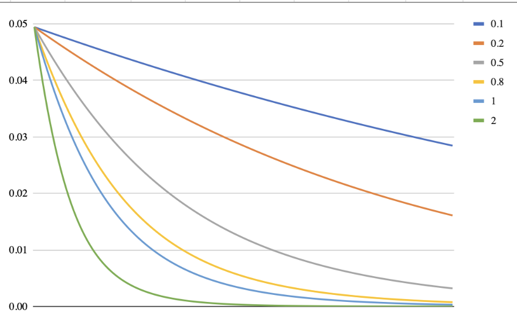

# 📚 Session 7 Assignment

## 📌 Table of Contents

1. [Problem Statement](#problem-statement)
2. [Backpropagation](#backpropagation)
3. [Additional Resources](#additional-resources)
## 🎯 Problem Statement

1. PART 1[250]: Rewrite the whole Excel sheet showing backpropagation. Explain each major step, and write it on GitHub. 
    - Use exactly the same values for all variables as used in the class
    - Take a screenshot, and show that screenshot in the readme file
    - The Excel file must be there for us to cross-check the image shown on readme (no image = no score)
    - Explain each major step
    - Show what happens to the error graph when you change the learning rate from [0.1, 0.2, 0.5, 0.8, 1.0, 2.0] 
    - Upload all this to GitHub and then write all the above as part 1 of your README.md file. 
    - Submit details to S6 - Assignment QnA. 
2. PART 2 [250]: We have considered many points in our last 5 lectures. Some of these we have covered directly and some indirectly. They are:
    - How many layers,
    - MaxPooling,
    - 1x1 Convolutions,
    - 3x3 Convolutions,
    - Receptive Field,
    - SoftMax,
    - Learning Rate,
    - Kernels and how do we decide the number of kernels?
    - Batch Normalization,
    - Image Normalization,
    - Position of MaxPooling,
    - Concept of Transition Layers,
    - Position of Transition Layer,
    - DropOut
    - When do we introduce DropOut, or when do we know we have some overfitting
    - The distance of MaxPooling from Prediction,
    - The distance of Batch Normalization from     - Prediction,
    - When do we stop convolutions and go ahead with a larger kernel or some other alternative (which we have not yet covered)
    - How do we know our network is not going well, comparatively, very early
    - Batch Size, and Effects of batch size
    - etc (you can add more if we missed it here)
3. Refer to this code: COLABLINK
    - WRITE IT AGAIN SUCH THAT IT ACHIEVES
        - 99.4% validation accuracy
        - Less than 20k Parameters
        - You can use anything from above you want. 
        - Less than 20 Epochs
        - Have used BN, Dropout,
        - (Optional): a Fully connected layer, have used GAP. 
        - To learn how to add different things we covered in this session, you can refer to this code: https://www.kaggle.com/enwei26/mnist-digits-pytorch-cnn-99 DONT COPY ARCHITECTURE, JUST LEARN HOW TO INTEGRATE THINGS LIKE DROPOUT, BATCHNORM, ETC.
4. This is a slightly time-consuming assignment, please make sure you start early. You are going to spend a lot of effort running the programs multiple times
5. Once you are done, submit your results in S6-Assignment-Solution
6. You must upload your assignment to a public GitHub Repository. Create a folder called S6 in it, and add your iPynb code to it. THE LOGS MUST BE VISIBLE. Before adding the link to the submission make sure you have opened the file in an "incognito" window. 
7. If you misrepresent your answers, you will be awarded -100% of the score.
8. If you submit a Colab Link instead of the notebook uploaded on GitHub or redirect the GitHub page to Colab, you will be awarded -50%
9. Submit details to S6 - Assignment QnA. 

## 🧠 Backpropagation

1. The below image shows the backpropagation steps for a simple neural network

2. The below image shows what happens to the error graph when you change the learning rate from [0.1, 0.2, 0.5, 0.8, 1.0, 2.0]
3. Link of the excel implementing the steps and calculating the loss for multiple iterations is [here](./Backpropagation.xlsx)

## 📖 Additional Resources

1. The code for PART 2 is [here](./Iteration_4.ipynb)