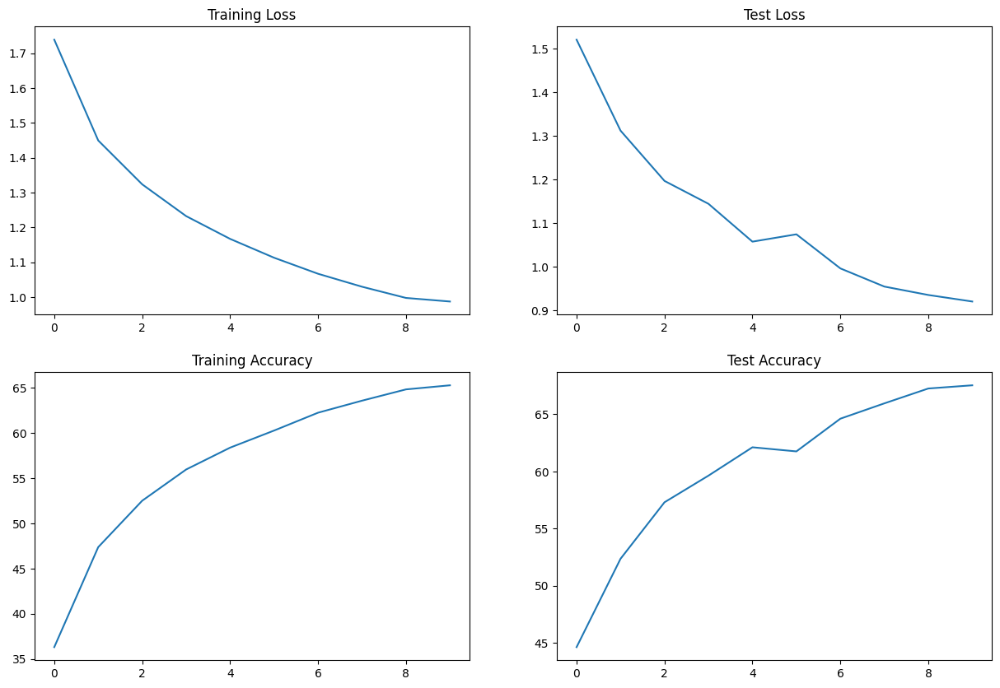

# 📚 Session 8 Assignment

## 📌 Table of Contents

1. [Problem Statement](#problem-statement)
2. [Introduction](#introduction)
3. [Normalization Methods](#normalization-methods)

## 🎯 Problem Statement
1. Change the dataset to CIFAR10.
2. Create the following network architecture:
   - C1 C2 c3 P1 C4 C5 C6 c7 P2 C8 C9 C10 GAP c11
   - `cN` denotes a 1x1 convolutional layer.
3. Ensure the parameter count is less than 50,000.
4. Set the maximum epochs to 20.
5. Implement the above architecture using three different normalization techniques:
   - Group Normalization (GN)
   - Layer Normalization (LN)
   - Batch Normalization (BN)
6. Achieve over 70% accuracy with each network.
7. Record the following details:
   - Training accuracy for each model.
   - Test accuracy for each model.
   - Your findings of each of the normalization techniques
8. Identify 10 misclassified images for each model and display them in a 5x2 image matrix for each normalization technique.

## 📚 Introduction
Th goal of the assignment is to understand how different normalization methods affect the loss curves and accuracies

## 🧪 Normalization Methods

### 📊 [Batch Normalization](./Session_8_BN.ipynb)

**<u>Results:</u>**

  - **Best train accuracy:** 66.55%  
  - **Best test accuracy:** 69.01%

**<u>Loss curves:</u>**

**<u>Misclassified images:</u>**

### 📊 [Layer Normalization](./Session_8_LN.ipynb)
**<u>Results:</u>**

  - **Best train accuracy:** 63.49%  
  - **Best test accuracy:** 65.00%

**<u>Loss curves:</u>**

**<u>Misclassified images:</u>**

### 📊 [Group Normalization](./Session_8_GN.ipynb)
**<u>Results:</u>**

  - **Best train accuracy:** 65.27%  
  - **Best test accuracy:** 67.54%

**<u>Loss curves:</u>**

**<u>Misclassified images:</u>**

### 📈 Analysis

Batch normalization performed the best, followed by Group normalization. As expected, Layer normalization had the least test accuracy as it normalizes each image across all channels